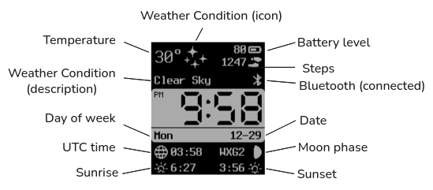
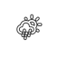
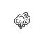
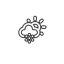
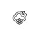
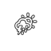
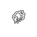

<h1 align="center">Last Time</h1>

A multifunctional Pebble watchface.

    <a href="https://apps.rebble.io/en_US/application/6953664f91ea9d0009ebd734">
        https://apps.rebble.io/en_US/application/6953664f91ea9d0009ebd734
    </a>

    

## Features

- Time, date, day of week
- Weather (Open-Meteo)
  - Text description
  - Weather icons (day/night)
- Temperature (°F/°C)
- Steps
- Battery level
  - Percentage
  - Icon
- Bluetooth status (connected/disconnected)
- Vibrate on Bluetooth disconnect
- Vibrate on the hour
- UTC time
- Sunrise/sunset
  - Displays the upcoming sunrise/sunset times.
    For example, if the current time is a few minutes
    past sunset, then the sunset time displayed will
    be for the following day.
- Moon phase

## Settings

- Temperature Unit
  - °F
  - °C
- Date Format
- Date Separator
- Vibrate on connect/disconnect
- Vibrate on the hour
- Weather Update Interval (minutes)

## Watches

- Pebble 2 Duo
- Pebble Time 2 (not yet supported)

## Weather

| Description                       | Icon (day)                               | Icon (night)                               |
| --------------------------------- | ---------------------------------------- | ------------------------------------------ |
| Clear / Mainly clear              |         |         |
| Partly cloudy / Overcast          |      |      |
| Fog / Icy fog                     |           |           |
| Drizzle / Rain / Showers          |          |          |
| Freezing drizzle / Freezing rain  |     |     |
| Snow / Snow grains / Snow showers |          |          |
| Thunderstorm                      |  |  |
| Hail storm                        |          |          |

## Moon Phases

| Abbreviation | Phase               | Icon                      |
| ------------ | ------------------- | ------------------------- |
| NEW          | New Moon            |   |
| WXC1         | Waxing Crescent (1) |  |
| WXC2         | Waxing Crescent (2) |  |
| WXC3         | Waxing Crescent (3) |  |
| WXC4         | Waxing Crescent (4) |  |
| WXC5         | Waxing Crescent (5) |  |
| WXC6         | Waxing Crescent (6) |  |
| 1ST          | First Quarter       |   |
| WXG1         | Waxing Gibbous (1)  |  |
| WXG2         | Waxing Gibbous (2)  |  |
| WXG3         | Waxing Gibbous (3)  |  |
| WXG4         | Waxing Gibbous (4)  |  |
| WXG5         | Waxing Gibbous (5)  |  |
| WXG6         | Waxing Gibbous (6)  |  |
| FULL         | Full Moon           |  |
| WNG1         | Waning Gibbous (1)  |  |
| WNG2         | Waning Gibbous (2)  |  |
| WNG3         | Waning Gibbous (3)  |  |
| WNG4         | Waning Gibbous (4)  |  |
| WNG5         | Waning Gibbous (5)  |  |
| WNG6         | Waning Gibbous (6)  |  |
| 3RD          | Third Quarter       |   |
| WNC1         | Waning Crescent (1) |  |
| WNC2         | Waning Crescent (2) |  |
| WNC3         | Waning Crescent (3) |  |
| WNC4         | Waning Crescent (4) |  |
| WNC5         | Waning Crescent (5) |  |
| WNC6         | Waning Crescent (6) |  |

## Publishing a new release

- Update the "version" in `package.json`
- Commit and tag the new version. Only update the major/minor versions. Seems
  like Pebble does not support patch versions.
  - e.g. `git commit -m "v1.2.0 && git tag v1.2.0`
- `pebble clean && ./build-release.sh`
- Draft a new release and upload `./build/last_time.pbw` via web UI
